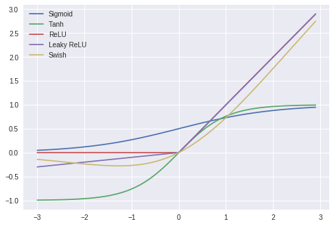

## Derin Öğrenme İçin Aktivasyon Fonksiyonlarının Karşılaştırılması :chart_with_upwards_trend: :chart_with_downwards_trend:

Aktivasyon fonksiyonları sinir ağlarında kilit bir rol oynar, bu nedenle daha iyi performans elde etmek için avantajlarını ve dezavantajlarını anlamak esastır.

En iyi bilinen sigmoid fonksiyonuna alternatif olan lineer olmayan aktivasyon fonksiyonlarını tanıtarak işe başlamak gerek. Aktivasyon fonksiyonlarının son performanslarını değerlendirirken birçok farklı koşulun önemi olduğunu unutmamak gerekir. O halde hazırsanız kolları sıvayalım ve biraz ellerimizi kirletelim!

YAKINDA!!!
### ⭐️Devamı için [blog yazımı okuyun](https://) ya da  [YouTube anlatımını izleyin](https://)! 

