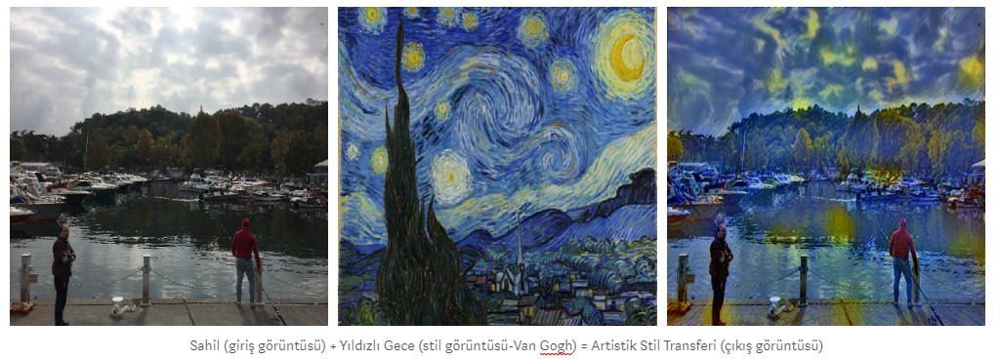
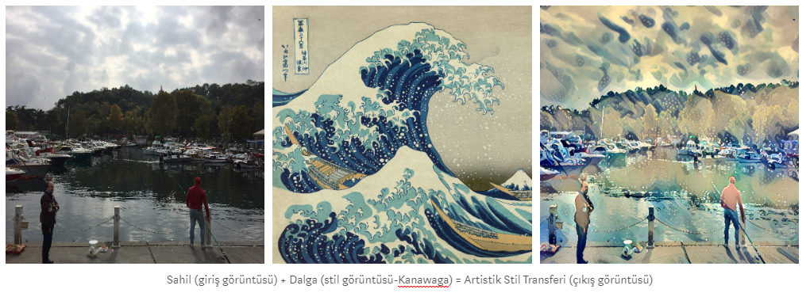
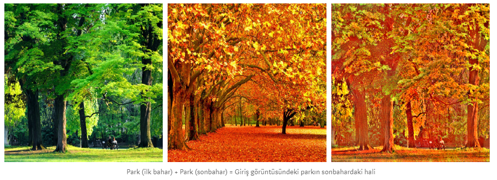

## Artistik Stil Transferi :art:

Stil transferi, girdi görüntüsünün stil  görüntüleri biçiminde yeniden oluşturulması tekniğidir. Her şey Gatys ve arkadaşlarının sanatsal üslubun bir resimden başka bir resme, evrişimsel sinir ağlarını kullanarak aktarmasının nasıl mümkün olduğuna dair harika bir makale yayımlamasıyla başladı.

Örneğin, haftasonu yürüyüşümde İstinye sahilinde çekmiş olduğum fotoğrafa Vincent Van Gogh'un Yıldızlı Gece (Starry Night) eserinin stilini transfer edersek aşağıdaki gibi görünecektir. Gerçekten artistik! 

### ⭐️Devamı için [blog yazımı okuyun](https://medium.com/deep-learning-turkiye/derin-%C3%B6%C4%9Frenme-ile-artistik-stil-transferi-29256789c7e8) ya da  [YouTube anlatımını izleyin](https://www.youtube.com/watch?v=fM28e7o6CJc)! 

